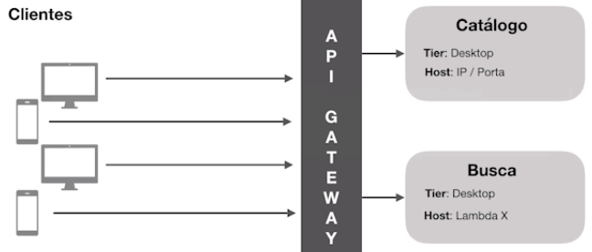
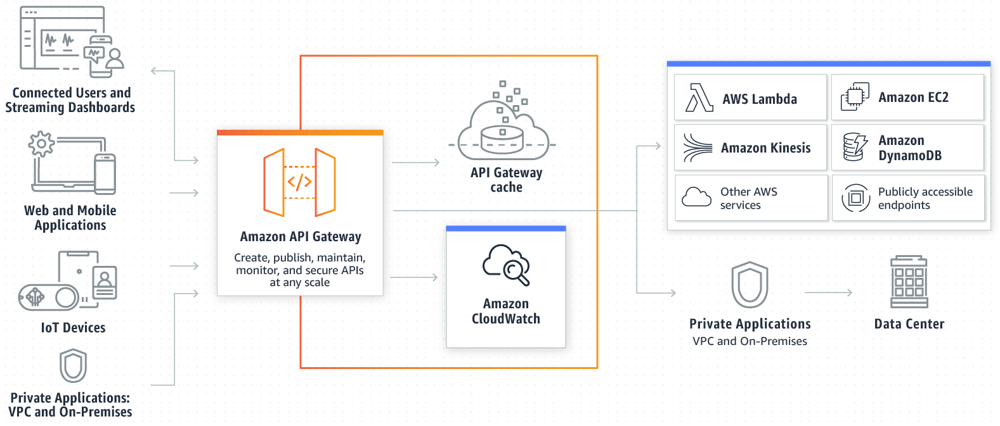
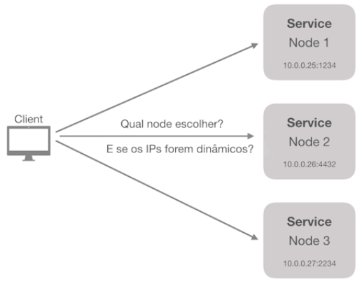
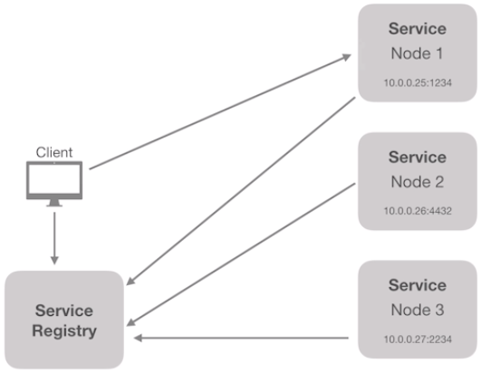
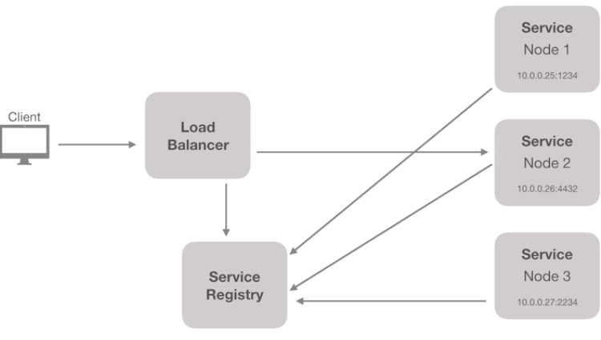
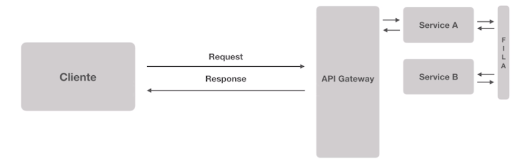

# Fundamentos de Arquiteura de Software

### O que é Arquitetura?
"Organização de um sistema, contemplando seus componentes, os relacionamentos entre estes, com o ambiente e os que governam seu projeto e evolução."

### Pilares
- Organização de um sistema
- Componentização
- Relacionamento entre sistemas
- Governança: Infraestrutura, Time e Arquitetura
- Ambiente
- Projeto: Tem inicio, meio e fim
- Projeção: Possibilidades futuras
- Cultura: Conflito entre a personalidade dos envolvidos

### Frameworks
São ferramentas e métodos que nos ajudam a focar essencialmente no objetivo final. Frameworks nos ajudam a definir um padrão de trabalho

- The TOGAF Standard
    - Framework conceitual
    - Definição dos processos de arquitetura
    - +900 Páginas
    - Conceitos e nomenclaturas
    - Visão geral de tipos de arquiteturas:
        - Negócio
        - Sistemas de informação
        - Tecnologia
        - Planos de migração
- ISO 42010:2011
    - Lançado em 2011 pelo ISO
    - Mais simplificado em relação as 900 páginas do TOGAF
    - Formaliza os fundamentos da área de arquitetura de software.

### Momentos da Arquitetura de Software na História
- Tradicional
- Atual
- Emergente
- Futuro

-------------------------
- Metodologias
- Tipos de aplicação
- Infraestrutura

##### Momento: Tradicional
Metodologia de desenvolvimento: Waterfall

Ciclo de vida do desenvolvimento de software:
1. Requirements Analysis
1. Design
1. Development
1. Testing
1. Maintenance 

Tipos de aplicações: Monolíticas

Infraestrutura: on-premise

##### Momento: Atual
- Metodologia de desenvolvimento: Agile
- Tipo de aplicações: Multi-tier architecture (Softwares Distribuidos)
- Infraestrutura: Virtualização

##### Momento: Emergente
- Metodologia de desenvolvimento: DevOps/FullCycle (Cultura)
- Tipos de aplicações: Microserviços
- Infraestrutura: Containers

##### Momento: Futuro
- NoOps
- Tipo de aplicações: Serverless Applications
- Infraestrutura Public Cloud

### Sistemas Monolíticos
- Tudo em um unico lugar; Tudo em um só sistema.
- Alto acoplamento
- Processo de deploy "completo" a cada mudança
- Normalmente usa uma tecnologia
- Um problrma afeta todo o sistema
- Maior complexidade para times
- Não é crime usar sistema monolítico
- Na maioria dos casos vai atender
- Menos complexidade na maioria dos casos
- Sistema monolítico é Vida!

### Escalando software
- Escala Vertical: Aumento de Recursos Computacionais. A mesma aplicação com mais recursos computacionais
- Escala Horizontal: Adição pequenas maquinas acessadas através de um LoadBalancer. Pequenos pedaços da aplicação acessados por um load balance

### Detalhes sobre a arquitetura da aplicação
- Disco efêmero
- Servidor de aplicação vs Servidor de assets
- Cache centralizado
- Sessões centralizadas
- Upload / Gravação de Arquivos

Tudo pode ter que ser destruído e criado facilmente.

### Distribuição de responsabilidades
Pensando de forma distribuida com o objetivo de manter uma aplicação com as responsabilidades bem definidas:
- **Aplicação** com responsabilidades bem definidas
- **Proxy** Reverso para gerenciar toda a parte de webserver
- **DB:** Banco de dados separado da aplicação (RDS da AWS)
- **Elastic** com a responsabilidade de gerenciar consuçtas/pesquisas
- **Static:** Gerenciamento de assets, arquivos estaticos, imagens...
- **Cache:** Gerenciamento de cache independente da Aplicação

Pensar de forma distribuida facilita a **escala Horizontal**, tendo a possibilidade de se ter a aplicação duplicada em diferentes regioes, consumindo a mesma fonte de dados (DB, Elastc, Assets, Cache...)
App Região 1, App Região 2, App Região 3, App Região N...

**...mas, ainda assim trata-se de uma aplicação monolítica.**

### Escala horizontal: Aplicação monolítica
- Ter imagens/Containers
- Ser facilmente reconstruído
- Ter suas responsabilidades, incluindo assets, etc..
- Sim, aplicações monolíticas podem ser totalmente escaláveis

### Quando aplicações monolíticas podem parar de valer a pena?
- Times grandes
- Necessidade de escalar todo o sistema pelo fato de uma área em especifico estar com pico de utilização.
- Risco de um deploy completo começa a se elevar
- Necessidade de utilizar tecnologias diferentes

### O que é um serviço
- Disponibiliza informação
- Realiza transações
- Resolve problemas de negócio
- Independente de tecnologia ou produto
- Pode estabelecer comunicação com diversos "clientes"

### SOA: Arquitetura Orientada a Serviço
- Serviços normalmente maiores baseadas em funcionalidades
- Necessidade de ESB
- Single point of failure
- Compartilhamento de banco de dados é comum
- Muitas vezes também podem ter sistemas monolíticos sendo utilizados como serviços

### Arquiteura baseada em microserviços
- Serviços pequenos com poucas responsabilidades
- Maior tolerância a falhas
- Totalmente independente
- Cada serviço possui seu próprio banco de dados
- Comunicação síncrona ou assíncrona

### Microserviços não são para todas as situações
- Arquitetura complexa
- Custo mais elevado
- Necessidade de mais equipes para manter
- Sistema precisa ser grande o suficiente para justificar
- Gera problemas que normalmente você não tinha antes
- Monitoramente complexo

**Microserviços não são moda, mas sim necessidade.**

### Microservices: Principais características (Martin Fowler)
- Componentização via serviços
- Organização em torno do negócio
- Estrutura baseada em Produtos. Não em projetos
- Smart endpoints & Dumb pipes
- Governança descentralizada
- Descentralização no gerenciamento de dados
- Automação de Infraestrutura
- Desenhado para falhar
- Design evolutivo

#### Componentização via serviços
- Services dos microserviços != Services da OO
- "Componente é uma unidade de software independente que pode ser substituida ou atualizada"

**Desvantagens**
- Chamadas externas são mais custosas do que chamadas locais
- Cruzamento entre componentes pode se tornar complexo
- Transações entre serviços são "grandes desafios"
- Mudanças bruscas em regras de negócio podem afetar diversos serviços tornando o processo difícil de ser refeito

#### Organização em torno do negócio
**Conceito importante**
Um projeto é baseado em um ou mais produtos que trabalham em diferentes contextos. 
- Time de desenvolvedores por produto
- Muitas empresas tratam os times como "squads"
- Cada squad é multidisciplinar
- Cada squad é responsavel por um ou mais produtos
- Cada produto pode ter um ou mais serviços envolvidos

### Microservices: Smart endpoints & dumb pipes
- Exposição de APIs (ex: Rest)
- Comunicação entre serviços
- Comunicação síncrona e assíncrona
- Utilização de sistemas de mensageria (ex: RabbitMQ)
- Garantia de que um serviço foi executado baseado na execução das filas

### Microservices: Governança descentralizada
- Ferramenta certa para o trabalho certo. Tecnologias podem ser definidas baseadas na necessidade do produto
- Diferentes padrões entre squads
- Contratos de interface de forma independente

### Microservices: Automação de infraestrutura
- Cloud computing
- Testes automatizados
- Continuous delivery
- Continuous Integration
- Load balancer/Autoscaling

### Microservices: Desenhado para falhar
- Tolerância a falha
- Serviços que se comunicam precisam de fallback
- Logging
- Monitoramento em tempo real
- Alarmes
  
### Microservices: Design evolutivo
- Produtos bem definidos podem evoluir ou serem extintos por razões de negócio
- Gerenciamento de versões
- Replacement and upgradeability

### API Gateways
"Uma API gateway recebe todas as chamadas de APIs dos clientes e então as roteia para os microserviços correspondentes..."
(nginx.com)

Em alguns casos ela também é responsável por realizar processos de verificação de segurança, como autenticação e autorização.

 

**API Gateway na AWS**

### Service Discovery
Processo de service Discovery é responsável por prover mecanismos de identificação dos serviços disponíveis e suas instâncias

**Service Discovery - Client Side**

**Service Discovery - Server Side**

#### Ferramentas populares:
- Netflix Eureka
- Consul
- Etcd
- ZooKeeper

### Comunicação entre microserviços
Comunicação Assíncrona: Mensageria

### Mecanismos de filas - RabbitMQ
- Message Broker
- Implementa AMQP (Advanced Message Queuing Protocol)
- Producer <==> Brokers <==> Consumers
- Desacoplamento entre serviços
- Rápido e Poderoso
- Padrão de mercado

### Dupla latência

### BFF - Backend for Frontend
Uma camada baseada no dispositivo/client que esta acessando a aplicação

