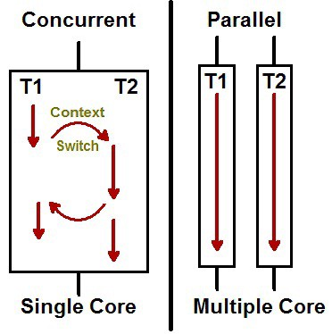

# Fullcycle - Fundamentos de Arquitetura de Software
___

## Tipos de arquitetura
- Software
- Solução
- Tecnológica
- Corporativa

#### Arquitetura Tecnológica
- Especialidade em tecnologias especificas de mercado
- Geração de valor baseado em especialidades
- Diversidade de profissionais especialistas
  - Arquiteto Elastic
  - Arquiteto Java
  - SQL Server
  - Oracle
  - SAP

#### Arquitetura Corporativa
- Impacta estrategicamente a orgabização como um todo
- Avaliação de custos
- Avaliação de possíveis novas tecnologias
- Padronização de tecnologias
- Planejamento de grandes inplantações
  - Sistemas "core"
  - Migrações

#### Arquitetura de Soluções
- Fica entre a área de negócios e software
- Transformar requisito de negócio em soluções de software
- Desenhos arquiteturais da solução de um software para reproduzir como ele irá funcionar
  - C4
  - UML
  - BPMN
- Analisa os impactos comerciais em relação a uma escolha tecnológica
- Pode participar do processo comercial de pré-venda e venda
- Analisa os impactos dos custos para o negócio

#### Arquiteto de Software
- É uma "disciplina" da engenharia de software
- Diretamente ligada ao processo de desenvolvimento de software
- Afeta diretamente na estrutura organizacional da empresa
  - Formação dos times
  - Estrutura dos componentes do software
  - "Organizações que desenvolvem sistemas de software tendem a produzir sistemas que são cópia das estruturas de comunicação dessas empresas. (Melvin Conway)"

É a relação entre os objetivos de negócio e suas restrições com os componentes a serem criados e suas responsabilidades visando sua evolução dosoftware.

"É a organização fundamental de um sistema e seus componentes, suas relações, seu ambiente, bem como os principios que guiam seu design e evolução." (IEEE Standard 1471)

#### Papel do Arquiteto(a) de Software
- Transformar requisitos de negócio em padrões arquiteturais
- Orquestrar pessoas desenvolvedores e experts de domínio
- Entender de forma prfunda conceitos e modelos arquiteturais
- Auxilia na tomada de decisão nos momentos de crise
- Reforça boas práticas de desenvolvimento
- Code reviews

Apesar de nem todas as organizações possuírem o cargo de arquiteto de software, normalmente profissionais mais experientes como desenvolvedores seniors e tech leads acabam realizando esse papel baseado em suas experiencias anteriores.

Há empresas que apesar de não possuírem o cargo de arquiteto(a) de software, possuem um departamento de arquitetura que auxilia os diversos times da organização com questões arquiteturais.

#### Por que aprender arquitetura de software?
- Poder navegar da visão macro para a visão micro de um ou mais softwares
- Entender quais são as diversas opções que remos para desenvolver a mesma coisa e escolher a melhor solução para determinado contexto
- Pensar a longo prazo no projeto e sua sustentabilidade
- Tomar decisões de forma fria e calculada evitando assim ser influenciado(a) por "hypes" de mercado
- Mergulho empadrões de projeto e de desenvolvimento e suas boas práticas
- Ter mais clareza do impacto que o software possui na organização como um todo
- Tomar decisões com mais confiança

## Arquitetura vs Design
- Arquitetura: Escopo global ou alto nível
- Design: Escopo local

"Atividades relacionadas a arquitetura de software são sempre de design. Entretanto, nem todas as atividades de design são sobre arquitetura. O objetivo primário da arquitetura de software é garantir que os atributos de qualidade, restrições de alto nível e os objetivos do negócio, sejam atendidos pelo sistema. Qualquer decisão de design que não tenha relação com este objetivo não é arquitetural. Todas as decisões de design para um componente que não sejam 'visíveis' fora dele, geralmente, também não são."

## Sustentabilidade
- Desenvolver software é caro
- Software resolve uma "dor"
- Software precisa se pagar ao longo do tempo
- Acompanhar a evolução do negócio
- Quanto mais tempo o software ficar no ar, mais retorno gera
- A solução precisa ser arquitetada

## Pilares da Arquitetura de Software
- Estruturação
  - Fácil evolução, componentização para atender os objetivos de negócio
- Componentização
- Relacionamento entre sistemas
- Governança

## Requisitos arquiteturais (RAs)
- Performance
- Armazenamento de Dados
- Escalabilidade
- Segurança
- Legal
- Audit
- Marketing

## Caracteristicas arquiteturais
Livro: Fundamentos de Arquitetura de Software
- Operacionais
- Estruturais
- Cross-Cutting

#### Caracteristicas Operacionais
- Disponibilidade
- Recuperação de desastres
- Performance
  - Latência
  - Throughput (Taxa de transferência)
- Recuperação (backup)
  - Testar backup
  - Backups em redes diferentes
- Confiabilidade e segurança
- Robustes
- Escalabilidade

#### Caracteristicas Estruturais
- Configurável
- Extensibilidade
- Fácil instalação
  - Padronização do ambiente em Containers
- Reuso de componentes
- Internacionalização
- Fácil manutenção
- Portabilidade (diversos bancos de dados)
- Fácil suporte (logs, debugging)

#### Caracteristicas Cross-Cutting
- Acessibilidade
- Processo de retenção e recuperação de dados (quanto tempo os dados serão mantidos)
- Autenticação e Autorização
- Legal
- Privacidade
- Usabilidade

## Perspectivas para arquitetar software de qualidade
- Performance
- Escalabilidade
- Resiliência

## Performance
- É o desempenho que um software possui para completar um determinado workload
- As unidades de medida para avaliarmos a performance de um software são:
  - Latência ou "response time"
  - Throughput
- Ter um software performático é diferente de ter um software escalável

#### Métricas para medir a performance
- Diminuir a latência
  - Normalmente medida em milliseconds
  - É afetada pelo tempo de processamento da aplicação, rede e chamadas externas
- Aumentando Throughput
  - Quantidade de requisições simultaneas
  - Diretamente ligado a latência

#### Principais razões para baixa performance
- Processamento ineficiente
- Recursos computacionais limitados
- **Trabalhar de forma bloqueante**
- **Acesso serial a recursos**

#### Principais formas para aumentar a eficiência
- Escala da capacidade computacional (CPU, Disco, Memória, Rede)
- Lógica por trás do software (Algoritmos, queries, overhead de frameworks)
- Concorrência e paralelismo
- Banco de dados (tipos de bancos, schema)
- Caching

#### Capacidade computacional: Escala Vertical vs Horizontal

#### Concorrência e paralelismo
"Concorrência é sobre **lidar com muitas coisas ao mesmo tempo**. Paralelismo é **fazer muitas coisas ao mesmo tempo**". Rob Pike

#### Caching
- Cache na borda/Edge computing
- Dados estáticos
- Páginas web
- Funções internas
  - Evita reprocessamento de algoritmos pesados
  - Acesso ao banco de dados
- Objetos

**Caching: Exclusivo vs Compartilhado**

**Exclusivo**
- Baixa latência
- Duplicado entre os nós
- Problemas relacionados a sessões

**Compartilhado**
- Maior latência
- Não há duplicação
- Sessões compartilhadas
- Banco de dados externo
  - MySQL
  - Redis
  - Memcache

**Caching: Edge computing**
- Cache realizado mais próximo ao usuário
- Evita a requisição chegar até o cloud Provider/Infra
- Normalmente arquivos estático ficam na edge
- CDN - Content Delivery Network
- Cloudflare workers
- Vercel

## Escalabilidade
Escalabilidade é a capacidade de sistemas suportarem o aumento (ou a redução) dos workloads incrementando (ou reduzindo) o custo em menor ou igual proporção.

#### Escalabilidade vs Performance
Enquanto **performance tem o foco de reduzir a latência e aumentar o throughput**, a **escalabilidade visa termos a possibilidade de aumentar ou diminuir o throughput adicionando ou removendo a capacidade computacional**.

#### Escalando software - Descentralização
- Disco efêmero: Sem preocupação com a perca de dados.
- Servidor de Aplicação vs Servidor de Assets
- Cache centralizado
- Sessões centralizadas
- Upload/Gravação de Arquivos

Tudo pode ser destruido e criado facilmente.

#### Escala de Banco de Dados
- Aumentando recursos computacionais
- Distribuindo responsabilidades (escrita vs leitura)
- Shards de forma horizontal
- Serverless

#### Otimização de queries e índice
- Use APM
- Trabalhe com índices de forma consciente
- Explain nas queries
- CQRS (Command Query Responsibility Segregation)
  
#### Proxy reverso
É um servidor que fica na frente dos servidores web e encaminha as solicitações do cliente (por exemplo, vavegador web) para esses servidores web.

**Soluções Populares**
- Nginx
- HAProxy (HA = High Availability)
- Traefik

## Resiliência
- É um conjunto de estratégias adotadas intencionalmente para a **adaptação** de um sistema quando uma falha ocorre.
- Resiliência: Você se dobra ou quebra
- Ter estratégias de resiliência nos possibilita minimizar os tiscos de perda de dados e transações importantes para o negócio

#### Quais as estratégias?

#### Proteger e ser protegido
- Um sistema em uma arquitetura distribuída precisa adotar mecanismos de autopreservação para garantir ao máximo sua operação com qualidade.
- Um sistema não pode ser egoista aoponto de realizar mais requisições em um sistema que está falhando
- Um sistema lento no ar muitas vezes é pior que um sistema fora do ar. (Efeito dominó)

#### Health check
- Sem sinais vitais, não é possível saber a "saúde" de um sistema
- Um sistema que não esta saudável possui uma chance de se recuperar caso o tráfego pare de ser direcionado a ele temporariamente
- Health check de qualidade

#### Rate Limiting
- Protege o sistema baseado no que ele foi projetado para suportar
- Preferência programada por tipo de client

#### Circuit breaker
- Protege o sistema fazendo com que as requisições feitas para ele sejam negadas. Ex: 500
- Circuito fechado = requisição chega normalmente
- Circuito aberto = requisição não chega ao sistema. Erro instantânea ao client
- Meio aberto = Permite uma quantidade limitada de requisição para verificação se o sistema tem condições de voltar ao ar integralmente.
- Circuit Breaker na Aplicação vs Na Rede

#### API Gateway
Centraliza o recebimento de todas as requisições.
- Garante que requisições "inapropriadas" cheguem até o sistema: Ex: usuário não autenticado
- Implementa políticas de Rate Limiting, Health check, etc

#### Service Mesh
- Controla o tráfego de rede
- Proxy ao lado do sistema. Camada entre as aplicações
- É possivel controlar e medir o trafego da rede
- Evita implementações de proteção pelo próprio sistema
- mTLS (Comunicação criptografada)
- CIrcuit breaker, retry, timeout, fault injection, etc

#### Trabalhar de forma assíncrona
- Evita perda de dados
- Não há perda de dados no envio de uma transação se o server estiver fora
- Servidor pode processar a transação em seu tempo quando estiver online
- Entender com profundidade o message broker/sistema de stream

#### Garantias de entrega com Retry
- Politica de novas tentativas. A applicação não controla Retry
- Lógica para re-tentativas

#### Garantias de entrega com Kafka
- Ack 0 - Envio sem garantia de entrega: Maior velocidade
- Ack 1 Leader - Envio com garantia de entrega: Perde um pouco na velocidade
- Ack 1 All - Envio com garantia de todos os brokers: Mais lento

<--- Velocidade ---|--- Garantia de entrega --->
<--- Ack 0 ---|--- Ack 1 Leader ---|--- Ack 1 All --->

#### Situações complexas
- Resiliencia: Importante, pensada no dia 0 de forma intencional
- O que acontece se o message broker cair?
- Haverá perda de mensagens?
- Seu sistema ficará fora do ar?
- Como garantir resiliência?